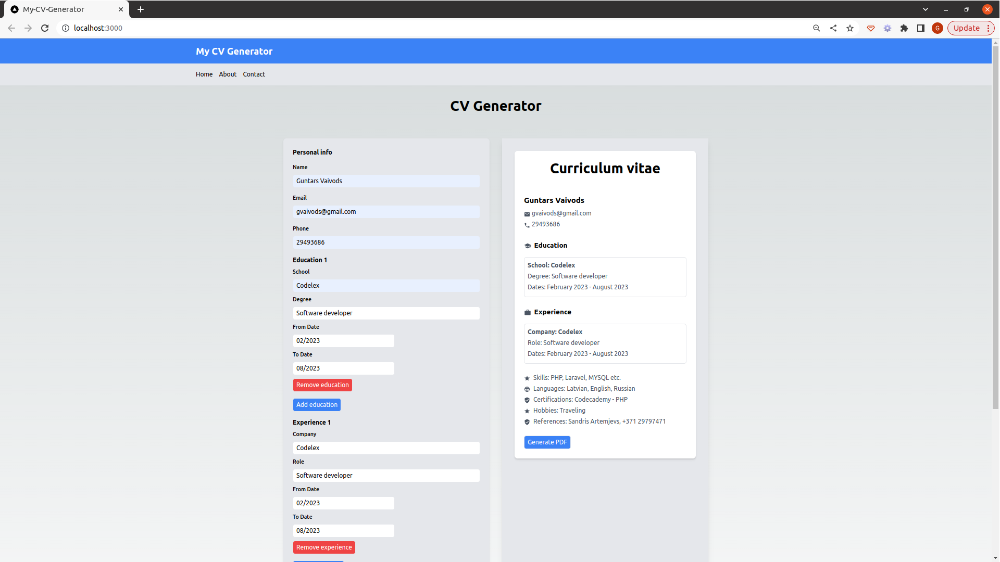

# My CV Generator - Next.js Learning Project

Welcome to my project! This application is a CV Generator, built as a learning project using Next.js.



This project is deployed using Vercel and you can access it [**here**](https://my-cv-generator.vercel.app/).

## 📐 Project Overview

This project's main goal is to provide a simple and intuitive way to create professional-looking CVs quickly. 

## ✨ Features

- Create a professional CV in a few steps
- Download your CV in PDF format


## 🚀 How to Use

Visit the deployed application at [**here**](https://my-cv-generator.vercel.app/) and follow the on-screen instructions to create your CV. Fill in your details, customize your sections, and download your CV in PDF format.

## 💻 How to Run Locally

```bash
# Clone this repository
git clone https://github.com/yourusername/my-cv-generator.git

# Go into the repository
cd my-cv-generator

# Install dependencies
npm install

# Start the server
npm run dev

Open http://localhost:3000 on your browser to view the application